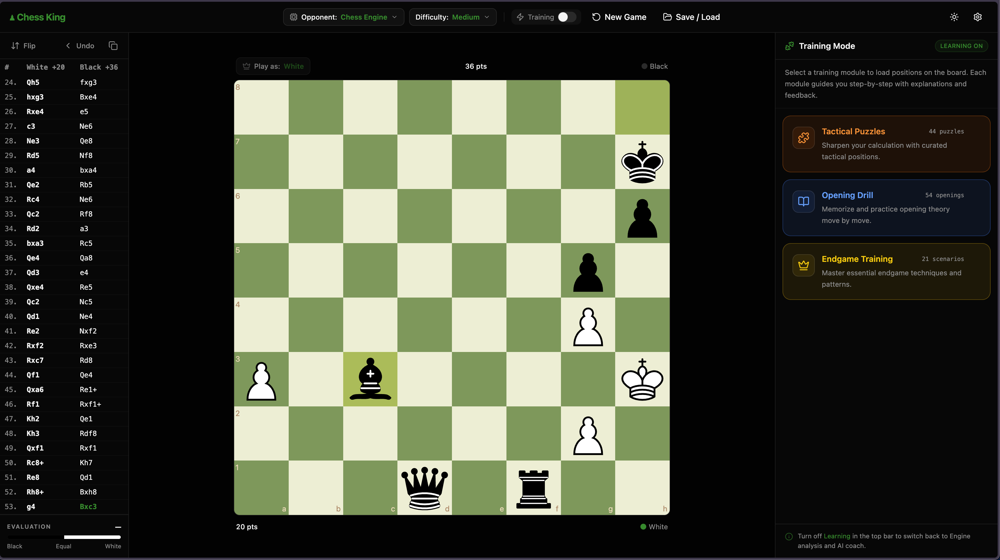
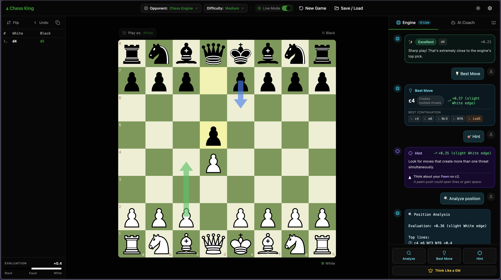
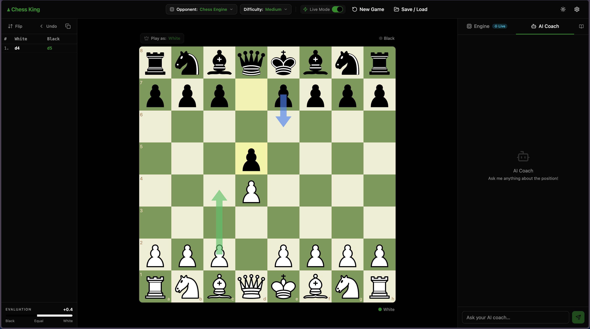

<div align="center">

# ♟️ Chess King

### Your AI-Powered Personal Chess Coach

[](https://react.dev)
[](https://vite.dev)
[](https://stockfishchess.org)
[](https://tailwindcss.com)
[](https://opensource.org/licenses/MIT)

**Chess King** is a fully browser-based, AI-powered chess training application that acts as your real-time personal coach. Unlike traditional chess apps that just show you the best move, Chess King explains *why* — teaching you to think like a Grandmaster.

[Features](#features) · [Screenshots](#screenshots) · [Getting Started](#getting-started) · [Tech Stack](#tech-stack)

</div>

---

## Screenshots

<table>
  <tr>
    <td align="center">
      
      <br/><sub><b>Live Game with AI Coach Panel</b></sub>
    </td>
  </tr>
  <tr>
    <td align="center">
      
      <br/><sub><b>Training Mode — Puzzles, Openings & Endgames</b></sub>
    </td>
  </tr>
  <tr>
    <td align="center">
      
      <br/><sub><b>Deep Engine Analysis with Best Move, Hints & Position Analysis</b></sub>
    </td>
  </tr>
</table>

---

## Features

### 🤖 AI Coaching Engine
- **Real-time AI Coach** — Conversational coaching powered by Google Gemini & OpenAI GPT-4o. Ask anything about any position and get human-like explanations
- **ELO-Aware Coaching** — AI adapts its language and depth of explanation to your skill level
- **Hint System** — Get a nudge in the right direction without spoiling the solution
- **Think Like a GM** — Deep GM-style thought process: candidate moves → calculation tree → positional plan → best move

### ♟️ Stockfish 18 Integration
- **Live Mode Analysis** — Stockfish 18 WASM engine runs entirely in-browser with zero server calls
- **Real-Time Evaluation Bar** — See the position advantage shift with every move
- **Best Move Suggestions** — Multi-PV analysis showing top engine lines with continuations
- **Position Analysis on Demand** — Full depth analysis with top lines and tactical themes

### 🎓 Training Modules
- **Tactical Puzzles** — 44 curated puzzles to sharpen your calculation and pattern recognition
- **Opening Drill** — 54 opening lines, memorize and practice theory move-by-move with explanations
- **Endgame Training** — 21 essential endgame scenarios to master fundamental techniques
- **Blunder Review Mode** — Replay your worst moves and learn from your mistakes

### 📊 Game Analysis
- **Move Quality Classification** — Every move rated: Excellent, Good, Inaccuracy, Mistake, Blunder
- **Threat Detection** — Automatic detection of forks, pins, skewers, and tactical patterns
- **Full Game Report** — Accuracy % for both players with move-by-move breakdown
- **Opening Recognition** — 40+ ECO codes identified and named in real-time

### 🛠️ Board & Gameplay
- **Play vs Chess Engine** — Custom minimax engine with alpha-beta pruning at multiple difficulty levels
- **Interactive Board** — Drag-and-drop moves with legal move highlighting and arrow annotations
- **Move History** — Full PGN-style notation sidebar with navigation
- **Position Setup** — Load any FEN position to analyze or practice from
- **Save & Load Games** — Persist your games locally via IndexedDB
- **Flip Board** — View from either side
- **Dark Mode** — Full dark/light theme support

---

## Getting Started

### Prerequisites
- Node.js 18+
- npm or yarn

### Installation

```bash
# Clone the repository
git clone https://github.com/Iamsdt/chess.git
cd chess

# Install dependencies
npm install

# Start the development server
npm run dev
```

Open [http://localhost:5173](http://localhost:5173) in your browser.

### Environment Variables

To enable AI coaching features, create a `.env` file in the root:

```env
VITE_GOOGLE_AI_API_KEY=your_google_gemini_api_key
VITE_OPENAI_API_KEY=your_openai_api_key
```

> **Note:** The app works fully offline for analysis and training. AI coaching features require API keys.

### Build for Production

```bash
npm run build
npm run preview
```

---

## Tech Stack

| Layer | Technology |
|---|---|
| Framework | React 19 + Vite 6 |
| Styling | Tailwind CSS 4 + Radix UI |
| Chess Engine | Stockfish 18 (WASM, Web Worker) |
| Chess Logic | chess.js |
| Board UI | react-chessboard |
| AI Coaching | Google Gemini + OpenAI GPT-4o |
| State Management | Zustand |
| Local Storage | IndexedDB (via idb) |
| Custom Engine | Minimax + Alpha-Beta Pruning |

---

## Project Structure

```
src/
├── components/          # UI components (board, panels, dialogs)
│   ├── board-panel.jsx  # Main chess board
│   ├── chat-panel.jsx   # AI coach chat interface
│   ├── training-panel.jsx
│   ├── puzzle-mode.jsx
│   ├── opening-drill-mode.jsx
│   ├── endgame-mode.jsx
│   └── blunder-review-mode.jsx
├── hooks/               # Custom React hooks
│   ├── use-engine-coach.js   # AI coaching logic
│   ├── use-ai-chat.js        # Chat management
│   └── use-chess-clock.js
├── lib/                 # Core logic
│   ├── engine.js        # Custom chess engine (minimax)
│   ├── stockfish.js     # Stockfish WASM wrapper
│   ├── intelligence.js  # Threat & tactic detection
│   ├── analyzer.js      # Full-game analysis
│   └── openings.js      # ECO opening database
├── store/
│   └── use-game-store.js     # Global game state (Zustand)
└── data/
    ├── puzzles.js       # 44 tactical puzzles
    └── endgames.js      # 21 endgame scenarios
```

---

## License

MIT © [Shudipto](https://github.com/Iamsdt)

---

<div align="center">
  <sub>Built with ♟️ and a lot of ☕ — Stop memorizing moves. Start understanding chess.</sub>
</div>
